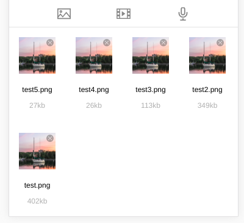
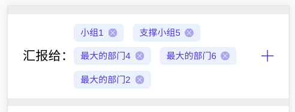
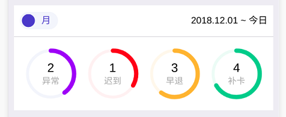
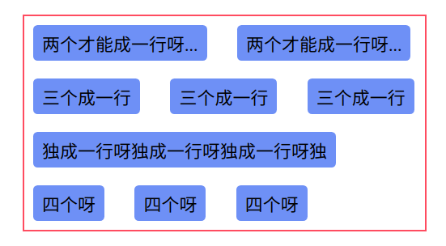
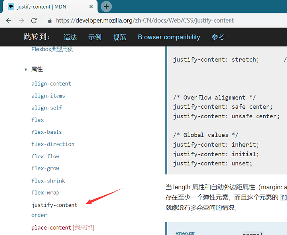
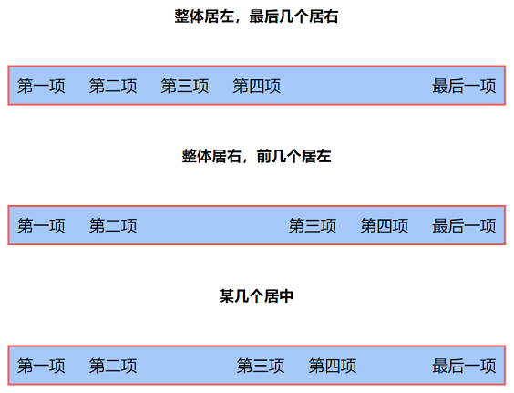

# CSS 列表项布局技巧

## 一、现有情况

1. 在开发中我们经常会遇到关于如何展示列表的问题，例如：

- 图片选择器列表



- 人员部门选择列表



- 工作状态列表



## 二、通用方法

1. 为了让其看起来更加舒适美观，通常我们会在每个列表项上添加 `margin-right` 和 `margin-bottom` 属性来隔开它们，然后一行超过容器长度后进行换行

2. 那么在各种情况下，如何处理列表项中`margin-right`和`margin-bottom`，让列表间隔和换行看起来更加自然美观是本篇的重点

## 三、各种情况下的布局

### 元素宽度已知，即知道每行最多多少个，且所有元素都在一个容器中

1. 思路：item 在一个容器中，每第三个去掉 margin-right，最后三个取消 margin-bottom（如最后一行不满 3 个也不影响）

2. 关键代码

```html
<div class='container'>
  <div class='item'>宽度已知，最多放三个</div>
  <div class='item'>宽度已知，最多放三个</div>
  <div class='item'>宽度已知，最多放三个</div>
  ...
</div>

<style>
  /* scss code */
  .container {
    .item {
      margin-right: 30px;
      margin-bottom: 20px;

      &:nth-child(3n) { margin-right: 0; } /* 一行最多几个就填 几n */
      &:nth-last-child(-n+3) { margin-bottom: 0; }
    }
  }
</style>
```

3. 运行截图


4. 完整代码

- [元素宽度已知，所有元素都在一个容器](./1.元素宽度已知，所有元素都在一个容器.html)

### 元素宽度已知 或 未知，且元素按照行数在相应容器中

1. 思路：最后一个 container 去掉 margin-bottom，最后一个 item 去掉 margin-right

2. 关键代码

```html
<div class='container'>
  <div class='item'></div>
  <div class='item'></div>
</div>
<div class='container'>
  <div class='item'></div>
  <div class='item'></div>
  <div class='item'></div>
</div>
<div class='container'>
  <div class='item'></div>
</div>

<style>
  /* scss code */
  .container {
    margin-bottom: 20px;
    &:last-child { margin-bottom: 0; }

    .item {
      margin-right: 30px;
      &:last-child { margin-right: 0; }
    }
  }
</style>
```

3. 运行截图



4. 完整代码

- [元素宽度已知或未知，且按照行数在相应容器](./2.元素宽度已知或未知，且按照行数在相应容器.html)

### 元素宽度未知，即不知道一行最多多少个，且所有元素都在一个容器中，常见于 flex 布局

**法1：Flex 布局**

1. 思路：利用 flex 布局的 justify-content 主轴属性来控制元素的间距

2. 缺点：flex 虽然强大，但是面对 长度不定的列表项布局 还是不能很好满足要求

3. 关键代码

```html
<div class='container'>
  <div class='item'>两个可以成一行</div>
  <div class='item'>两个可以成一行</div>
  <div class='item'>这三个字</div>
  <div class='item'>独成一行呀独成一行呀独成一行呀独成</div>
  <div class='item'>两个才能成一行呀</div>
  <div class='item'>四个</div>
</div>

<style>
  /* scss code */
  .container {
    display: flex;
    flex-wrap: wrap;
    justify-content: space-between; /* 可以尝试其他值，但效果仍不好 */

    .item {
      /* margin-right: 30px; 可以不用 m-r，由 flex 来控制左右间距 */
      margin-bottom: 20px;
    }
  }
</style>
```

4. 运行截图


5. 完整代码

- [元素宽度已知或未知，且按照行数在相应容器](./3.1元素宽度未知，且所有元素都在一个容器.html)

**法2：负margin**

1. 接下来介绍 负margin 方法，可以很好的解决 长度不定的列表项布局 问题

2. 思路：用一个 wrapper 包在最外层，container 设置 负的 margin 来抵消 item 的 外边距

- 参考链接：[https://segmentfault.com/q/1010000005882081/a-1020000005894468](https://segmentfault.com/q/1010000005882081/a-1020000005894468)

3. 关键代码

```html
<div class="wrapper">
  <div class='container'>
    <div class='item'>两个才能成一行呀</div>
    <div class='item'>两个才能成一行呀</div>
    <div class='item'>这三个字</div>
    <div class='item'>独成一行呀独成一行呀独成一行呀独</div>
    <div class='item'>四个</div>
  </div>
</div>

<style>
  /* scss code */
  .wrapper {
    .container {
      display: flex;
      flex-wrap: wrap;
      margin-right: -30px;
      margin-bottom: -20px;

      .item {
        margin-right: 30px;
        margin-bottom: 20px;
      }
    }
  }
</style>
```

4. 运行截图


5. 完整代码

- [法2：元素宽度未知，且所有元素都在一个容器](./3.2元素宽度未知，且所有元素都在一个容器.html)

#### flex 布局中元素整体居左，最后几个居右；整体居右，前几个居左；某几个居中

有多少人有过被 `justify-self: flex-end;` 支配的恐惧，其实没有这个属性啦！



- 参考链接：[https://www.zhubenjie.com/article/5ac48df686a651221c217dec](https://www.zhubenjie.com/article/5ac48df686a651221c217dec)

**法1：flex: 1 + text-align**

1. 思路：给 flex 布局中的元素设置了 flex: 1，可以类似看成 display: block 元素，所以设置 text-align 就搞定

2. 关键代码

```html
<div class='container'>
  <div class='item'>第一项</div>
  <div class='item'>第二项</div>
  <div class='item'>第三项</div>
  <div class='item'>最后一项</div>
</div>

<style>
  /* scss code 整体居左，某几个元素居右 */
  .container {
    display: flex;
    justify-content: flex-start; /* 默认为 flex-start */

    .item {
      &:nth-last-child(2) { /* 想让最后几个元素居右就填几 */
        flex: 1;
        text-align: right;
      }
    }
  }
</style>

<style>
  /* scss code 整体居右，某几个元素居左 */
  .container {
    display: flex;
    justify-content: flex-end;

    .item {
      &:nth-child(2) { /* 想让前几个元素居左就填几 */
        flex: 1;
        text-align: left;
      }
    }
  }
</style>

<style>
  /* scss code 整体居左，某几个居中 */
  .container {
    display: flex;

    .item {
      &:nth-child(2) { /* 想从第前几个元素开始居中 */
        flex: 1;
        text-align: right;
      }

      &:nth-child(4) { /* 想从第前几个元素结束居中 */
        flex: 1;
        text-align: left;
      }
    }
  }
</style>
```

3. 运行截图


4. 完整代码

- [4.1flex布局中个别元素居左，居中，居右](./4.1flex布局中个别元素居左，居中，居右.html)

**法2：margin-* auto**

1. 思路：对于 flex 布局的元素也可以通过 margin 来调整位置

2. 关键代码（代码基本与 法1 类似，可在完整代码具体查看）

```html
<div class='container'>
  <div class='item'>第一项</div>
  <div class='item'>第二项</div>
  <div class='item'>第三项</div>
  <div class='item'>最后一项</div>
</div>

<style>
  /* scss code 整体居左，某几个元素居右 */
  .container {
    display: flex;

    .item {
      &:nth-last-child(2) { /* 想让最后几个元素居右就填几 */
        margin-left: auto;
      }
    }
  }
</style>

<style>
  /* scss code 整体居右，某几个元素居左 */
  .container {
    display: flex;
    justify-content: flex-end;

    .item {
      &:nth-child(2) { /* 想让前几个元素居左就填几 */
        margin-right: auto;
      }
    }
  }
</style>

<style>
  /* scss code 整体居左，某几个居中 */
  .container {
    display: flex;

    .item {
      &:nth-child(2) { /* 想从第前几个元素开始居中 */
        margin-left: auto;
      }

      &:nth-child(4) { /* 想从第前几个元素结束居中 */
        margin-right: auto;
      }
    }
  }
</style>
```

3. 运行截图



4. 完整代码

- [4.2flex布局中个别元素居左，居中，居右](./4.2flex布局中个别元素居左，居中，居右.html)

## 四、总结

1. 多多利用 css3 属性来帮助我们更好的布局列表，避免使用 js 控制列表项，做到 css 与 js  解耦，更利于项目的维护

2. 以上可能未包含所有情况，欢迎提出或者分享其他更好的解决办法
